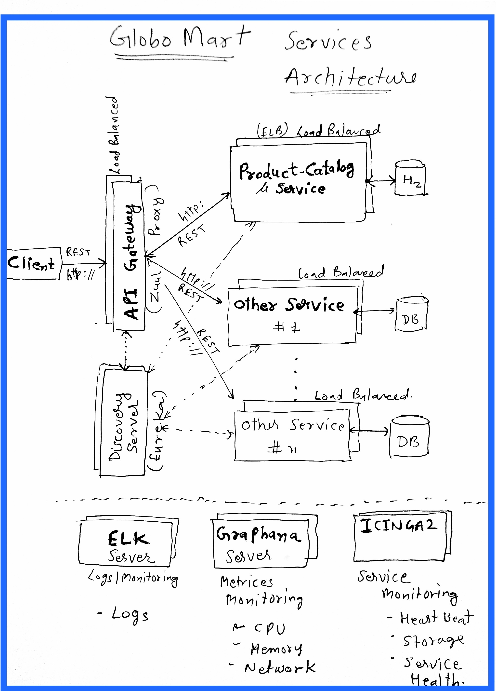

## GloboMart Services

# Architecture

## Product Catalog Service
Product Catalog Service is a Microservice which provides end-point to add, remove, find products.

* Swagger-UI: http://localhost:8080/swagger-ui.html#/product-controller

* End-Points:
~~~
GET     /api/products                       - gets all products as a list
GET     /api/products?type={productType}    - gets all products for a given productType

GET     /api/products/{productId}           - gets a product with given productId

POST    /api/products/                      - creates a new product

DELETE  /products/{productId}               - deletes a product for given productId
~~~

## NFRs:

# API Gateway:
    * This can be implemented using Zuul proxy (Spring cloud)
    * It can be used for service orchestration and various other purposes

# Discovery Server:
    * We can use Eureka Discovery for the purpose

# Logs - ELK Stack
    * ElasticSearch | LogStash | Kibana

# Metrics - Graphana with Graphite
    * It can monitor:
        ** CPU Usage
        ** Memory Usage
        ** Network Usage

# Service Monitoring - ICInga2
    * It can monitor:
        ** Service Health
        ** Heartbeat
        ** Disk Storage
        ** Other
